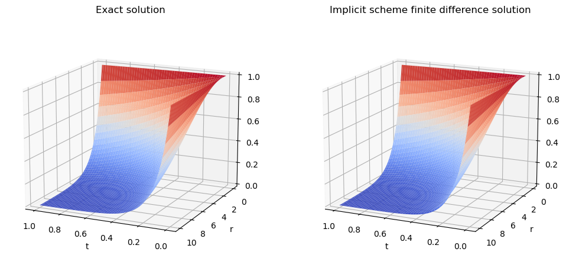
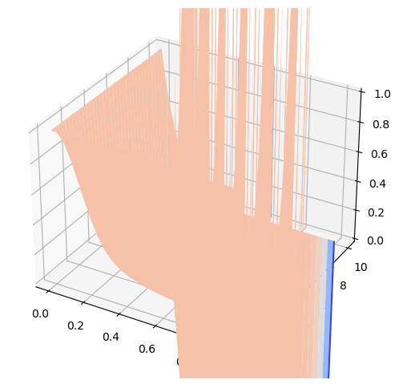

<h1> Pricing Options </h1>

The following is a toy example to understand the <strong> Risk Neutral Measure </strong> for pricing derivative securities. Under this risk neutral measure it is guaranteed a no arbitrage price.

First, let us define this notion of arbitrage:

<strong>Definition </strong> An arbitrage is a portfolio value processe $X(t)$ satisfying that $X(0)=0$ and for some time $T>0$:

$$
\mathbb{P}(X(T) \geq 0)=1\quad\text{and }\quad \mathbb{P}(X>0)>0.
$$

<h5> Toy Example</h5>
Consider a one-period model, the stock a time 0 has price $S(0)=4$, at time $t=1$ with probability $p$ it goes up by a factor of $u=2$ and with probability $1-p$ it goes down by a factor $d=1/2$. The interest rate is $r=1/4$. Therefore 

$$
S_1 = \begin{cases}
2*S_0 = 8 &\quad\text{with probability } p\\
0.5*S_0 = 2 &\quad\text{with probability } 1-p
\end{cases}
$$
Consider an European call option with maturity of $T=1$ and strike $K=5$. The payoff is therefore 

$$
(S_1 - K)^{+} = \begin{cases}
(8-5)^{+} = 3 &\quad\text{with probability } p\\
(2-5)^{+} = 0 &\quad\text{with probability } 1-p
\end{cases}
$$

The goal is to determine a price for this option. To achieve this, consider the following situation: You start with an initial wealth $X_0=1.2$ and buy $\Delta_0 =0.5$ shares of the stock whose price is $S$. Since the stock at time zero costs $4$ per share, you must use your initial wealth $X_0$ and borrow and additional of $0.80$ to do this. This leave you with a cash position of $X_0 - \Delta_0 S_0 = -0.8$ (a debt of 0.8 to the money market). At time 1 your cash position will be $(1+r)(X_0 - \Delta_0 S_0) = -1$ (i.e the cash at time 0 with rate growth of $r =1/4$) This means that at time 1 you will have a debt of 1 to the money market. 

On the other hand, at time 1 you will have your stock valued at $\Delta_0 S_1$ , that is, with probability $p$ it will be $\Delta_0 *S_1 = 0.5*8 = 4$ and with probability $1-p$ it will be valued at $\Delta_0 *S_1 = 0.5*2 =1$, therefore your wealth at time 1 will be

$$
X_1 = \Delta_0 S_1 + (1+r)(X_0 - \Delta_0 S_0)=\begin{cases}
4 + (-1)= 3 &\quad\text{with probability }p\\
1 + (-1)=0 &\quad\text{with probability } 1 - p
\end{cases}
$$

That is, your portofolio $X$ at time 1 has the same value as the call option. We say that we have <em> replicated the option</em> by trading in the stock and money markets.

The initial wealth $X_0=1.20$ needed to set up the replicating portfolio $X$ is the <em>no-arbitrage price of the option at time zero </em>. For, if one could sell the option for more than 1.2, say, for 1.21, then the seller could invest the excess 0.01 in the money market and use the remaining 1.2 to replicate the option. At time 1 the seller would be able to pay off the option regardeless of the value of the stock a time 1, S_1, and still have the remaining $(1+r)*0.01 = 0.0125$ resulting from the money market investment. This is an arbitrage because the seller of the option needs no money initially and without risk of loss has 0.0125 at time 1. On the other hand if one could buy the option for less than the $X_0 =1.2$, say, for 1.19 then one should buy the option and set up the replicating portfolio in reverse. That is, we sell-short $\Delta_0=1/2$ of the stock (we receive 2 dollars) at time 0 then with 1.19 buy the option, invest 0.8 in the money market and put the ramaining 0.01 in a separate money market. At time 1 if the stock goes up then the option pays 3 and the 0.8 is worth 1, thus with this 4 you are able to close the short position. On the contrary, if the stock goes down the option pays 0 and the 0.8 is at time 1 worth 1 dollar which is also the value you have to pay to close the short position. In either case you will end up with 0.0125 which is the 0.01 in the separate money market whose value at time 1 is $(1+r)0.01=0.0125$. Therefore there is again arbitrage.

How one would get to this fair price of 1.20?   To determine the price  at time 0 of this opton, $V_0$ suppose we begin with wealth $X_0$ and buy $\Delta_0$ shares of the stock $S$ ($X_0$ adn $\Delta_0$ unknown). Then the cash position at time 0 is $X_0 - \Delta_0*S_0$ and thus, the value of this portfolio (of stock and money market) at time 1 is:

$$
X_1 = \Delta_0*S_1 +(1+r)(X_0 - \Delta_0*S_0) = (1+r)X_0 + \Delta_0(S_1 -(1+r)S_0)
$$
The goal is to choose $X_0$ and $\Delta_0$ so that at time 1 the value of this portfolio and the value of the option coincide. If we denote $V_1$ the value of the option at time 1, we know that its value is with probability $p$ 3 dollars and with probability $1-p$ 0 dollars (this is because the maturity is 1 and at this final time the value of the option is its payoff). Thus we llok for $X_0,, \Delta_0$ such that

$$
X_1 = (1+r)X_0 + \Delta_0(S_1 -(1+r)S_0) = V_1
$$

which is equivalent to 

$$
X_0 + \Delta_0\left(\frac{1}{1+r}S_1 -S_0\right) = \frac{1}{1+r}V_1
$$

Recall that $S_1$ is random and so $V_1, X_1$ are. The random variable $S_1$ can take two possible values: $S_0*u$ and $S_0*d$ where $u=2,~ d= \frac{1}{2}$ with probabilities $p$ and $1-p$ respectively. Also, $V_1$ take the values of 3 and 0 with this probabilities. Then we have two equations:

$$
\begin{aligned}
X_0 + \Delta_0\left(\frac{1}{1+r}S_0*u -S_0\right) =& \frac{1}{1+r}3  \qquad\text{(1)}\\
X_0 + \Delta_0\left(\frac{1}{1+r}S_0*d -S_0\right) =& \frac{1}{1+r}0  \qquad\text{(2)}
\end{aligned}
$$

To find the values of $X_0$ and $\Delta_0$ out of these equations let us multiply equation (1) by a the number $q$ and equation (2) by the number $1-q$ and add them. These numbers are for now unknown but they will be determined as well. Thus we get:

$$
\begin{equation}
X_0 + \Delta_0\left(\frac{1}{1+r}(q*S_0*u + (1-q)*S_0*d) -S_0\right) = \frac{1}{1+r}(3q +0(1-q)) \tag{3}
\end{equation}
$$

If $q$ is chosen such that $S_0 = \frac{1}{1+r}(q*S_0*u + (1-q)*S_0*d)$ then we will get from (3) that:

$$
X_0 =  \frac{1}{1+r}(3q +0(1-q)) \tag{3}
$$

And 
$$
\Delta_0 = \frac{3 - 0}{S_0*u - S_0*d} \qquad \text{Delta-Hedging formula}
$$ 

obtained by substracting equation (2) from equation (1). 

Finally, the number $q = \frac{1+r - d}{u - d}$ obtained from  $S_0 = \frac{1}{1+r}(q*S_0*u + (1-q)*S_0*d)$.

Note that if $0<d<(1+r) < u <1$, then the number $q$ satisfies the following: $q~ 1-q \in(0,1)$, and their sum is 1. This means that the numbers $q, 1-q$ can be interpreted as probabilities and the expression for $X_0$ is nothing but the discounted expected value of the random variable $V_1$ under the probability law $q$, i.e,

$$
X_0 = \frac{1}{1+r}\mathbb{E}_q(V_1)
$$

This new probability law is called the <strong> Risk Neutral Measure </strong>. Observe that, by its very own definition:

$$
S_0 = \frac{1}{1+r}(q*S_0*u + (1-q)*S_0*d) =\frac{1}{1+r}\mathbb{E}_q(S_1\vert S_0) 
$$

that is, the discounted expected value of $S_1$ given the value $S_0$, coincides with $S_0$, meaning that the stock price is a Martingale process. From the equation for $X_1$, by taking expected value with respect to the probability law $q$ we can conclude the same for the price process of the portfolio, i.e:

$$
\frac{1}{1+r}\mathbb{E}_q(X_1\vert X_0) = X_0.
$$

In the examples below we will start already from the measure $q$ which can be defined in terms of the parameters of the problem such us th numbers $u, d, r, \sigma$ and the measure $p$ will not play any role. Finally, instead of discounting by multiplying by the fraction $\frac{1}{1+r}$ we will do it by muliplying by $\exp(-\widetilde{r})$ with $\widetilde{r}$ such that those two quantities coincide and even more, we will lose the tilde in the notation. 


<h2> Pricing under CRR binomial tree for a non path-dependent payoff </h2>

In this section we implement the <strong> Backwards Induction Algorithm </strong> for pricing options whose payoff $g$ is a function of the stock price at maturity time, i.e, $g(S_N)$. We make both the European and American cases under the Cox-Ross-Rubinstein parametrisation for the binomial tree.

Examples of non path-dependent payoffs are:

* European call option with payoff $g(S_T) = (S(T) - K)^{+}$
* European put option whith payoff $g(S_T) = (K - S(T))^{+}$

where in both cases $T$ is the maturity, $S(t)$ is the stock price at time $t$ and $K$ is the strike value.
 

We also include the case of American options although they are, technically speaking, path-dependent.


```python
import numpy as np
import matplotlib.pyplot as plt

```


```python
def CRR_binomial_model_European(N, T, S_0, r, sigma, payoff,*params):

    delta_t = T/N
    u = np.exp(sigma*np.sqrt(delta_t))
    d = 1/u
    q = (np.exp(r*delta_t) - d)/(u - d)

    V = np.zeros((N+1, N+1))
    V[:, N] = np.array([payoff(S_0 * u**(N - k) * d**k, *params) for k in range(N+1)])

    for n in range(N-1, -1, -1):
        for k in range(0, n+1):
            V[k, n] = np.exp(-r*delta_t)*(q * V[k, n+1] + (1 - q) * V[k+1, n+1])

    return V
```


```python
T = 1
N = 2
sigma = 0.2
r = 0.01
K = 100
S_0 = 100

put = lambda S, K: np.maximum(K - S, 0)

```


```python
CRR_binomial_model_European(N, T, S_0, r, sigma, put, K)
```


    array([[ 6.5354428 ,  0.        ,  0.        ],
           [ 0.        , 12.68890338,  0.        ],
           [ 0.        ,  0.        , 24.63616836]])


```python
def CRR_binomial_model_American(N, T, S_0, r, sigma, payoff,*params):

    delta_t = T/N
    u = np.exp(sigma*np.sqrt(delta_t))
    d = 1/u
    q = (np.exp(r*delta_t) - d)/(u - d)

    V = np.zeros((N+1, N+1))
    intrinsic_value = np.zeros((N+1, N+1))
    intrinsic_value[:, N] = np.array([payoff(S_0 * u**(N - k) * d**k, *params) for k in range(N+1)])
    V[:, N] = intrinsic_value[:, N]
    continuation_value = np.zeros((N, N))

    for n in range(N-1, -1, -1):
        for k in range(0, n+1):
            intrinsic_value[k, n] = payoff(S_0 * u**(n - k) * d**k, *params)
            continuation_value[k, n] = np.exp(-r*delta_t)*(q * V[k, n+1] + (1 - q) * V[k+1, n+1])
            V[k, n] = np.maximum(intrinsic_value[k,n], continuation_value[k, n])

    return V, continuation_value, intrinsic_value
```


```python
T = 1
N = 2
sigma = 0.2
r = 0.01
K = 100
S_0 = 100

put = lambda S, K: np.maximum(K - S, 0)

V, V_tilde, g = CRR_binomial_model_American(N, T, S_0, r, sigma, put, K)

print(V)
print(V_tilde)
print(g)

```

    [[ 6.79232596  0.          0.        ]
     [ 0.         13.18765546  0.        ]
     [ 0.          0.         24.63616836]]
    [[ 6.79232596  0.        ]
     [ 0.         12.68890338]]
    [[ 0.          0.          0.        ]
     [ 0.         13.18765546  0.        ]
     [ 0.          0.         24.63616836]]


```python
def Pricing_under_CRR_binomial_tree(N, T, S_0, r, sigma, payoff, *params, option = "Europea"):


    if option == "Europea":
        V = CRR_binomial_model_European(N, T, S_0, r, sigma, payoff, *params)
        return V[0, 0]
    
    if option == "American":
        V, _ , _= CRR_binomial_model_American(N, T, S_0, r, sigma, payoff, *params)
        return V[0,0]
```


```python
Pricing_under_CRR_binomial_tree(N, T, S_0, r, sigma, put, K, option="American")
```


    6.792325962768274


```python
Pricing_under_CRR_binomial_tree(N, T, S_0, r, sigma, put, K)
```


    6.535442795242758


<h2> Pricing options with path-dependent payoff </h2>

In this section we focus on pricing options whose payoff is a function of the stock price at different times, e.g, $g(S_0, S_1, S_2,\dots, S_N)$

<h2> Black-Scholes Model </h2>

There are at least to different approaches to arrive at this model. One is by getting a partial differential  equation for the price of an option and the other is by the Martingale Representation Theorem (pricing under Risk-Neutral Measure)  which gives us directly the value of the option with no need of solving a PDE. The price of the latter approach is that the value of the option is expressed as a conditional expectation which is sometimes more difficult to compute/estimate than a PDE. Also, the Martingale setting allows us to arrive to a formula for the value of an option whose payoff at maturity time could be path-dependent and whose underlying asset follows a Generalized Brownian Motion, that is, the stock price has non constant mean return and volatility processes.

<h3> Some Ito Calculus. </h3>
First let us recall some definitions and formulas:

1. <strong> Ito Process </strong>. Is a stochastic process $\{X(t)\}$ of the form:

$$
\begin{align}
X(t) = X(0) + \int_0^t \Delta(s)dW(s) + \int_0^t\Theta(s)ds
\end{align}
$$

with $X(0)$ non random and $\{\Delta(t)\},~\{\Theta(t)\}$ stochastic process adapted to the filtration $\mathcal{F}_t$ induce by the Brownian motion $\{W(t)\}$ and such that 
$$
\mathbb{E}[\int_0^t\Delta^2(s)ds], ~~ \int_0^t|\Theta(s)|ds <\infty
$$

The formula above for $X(t)$ is equivalent to

$$
dX(t) = \Theta(t)dt +\Delta(t)dW(t).
$$


2. <strong> Ito Formula</strong>. Let $\{X(t)\}$ be an Ito process and $f:\mathbb{R}^2 \to \mathbb{R}$ be a $C^2$ function. Then for all $t>0$

$$
d(f(t, X(t))) = f_t(t, X(t))dt + f_x(t, X(t))dX(t) + \frac{1}{2}f_{xx}(t X(t))dX(t)dX(t) 
$$

where $f_t, ~f_x, ~f_{xx}$ denote partial derivatives of the function $f$ with respect to the firs and second variable. Aslo to compute $dX(t)dX(t)$ we use "the rules":

$$
dt*dt = dt*dW(t) =0\qquad \text{and }\quad dW(t)dW(t) = dt.
$$

3. <strong>Stochastic Differential Equation (SDE).</strong> An SDE is an equation of the form:
$$
dX(t) = \beta(t, X(t))dt + \gamma(t, X(t))dW(t)
$$

where $\beta$ and $\gamma$ are random processes called the <em> drift</em> and <em>difussion</em> respectively. In adition to this equation, an initial condition of the form $X(t_0)=x$ is especified. The problem is then to find a stochastic process $\{X(t)~~t\geq t_0\}$ such that:

$$
\begin{align*}
X(t_0) =& x\\
X(t) =& X(t_0) + \int_{t_0}^t\beta(u, X(u))du + \int_{t_0}^t\gamma(u, X(u))dW(u)
\end{align*}
$$

The paradigmatic example in this notebook is the <em>Geometric Brownian Motion.</em>

<strong>Geometric Brownian Motion</strong>. Is a process of the form:
$$
dX(t) = X(t)(\mu dt + \sigma dW(t))
$$

The solution of the above SDE is

$$
X(t) = X(0)\exp\left[(\mu - \frac{1}{2} \sigma^2)t + \sigma W(t)\right]
$$

the Generalized Geometric Brownian Motion is one with $\mu$ and $\sigma$ non constant adapted processes:

$$
dX(t) = X(t)(\mu(t) dt + \sigma(t) dW(t))
$$

The solution of the above SDE is

$$
X(t) = X(0)\exp\left[\int_0^t(\mu(s) - \frac{1}{2} \sigma(s)^2)ds + \int_0^t\sigma(s) dW(s)\right]
$$


<h3> Black-Scholes Equation. </h3>

Consider a stock whose price $S(t)$ is a Geometric Brownian motion

$$
dS(t) = S(t)(\mu dt + \sigma dW(t))
$$
and a European call option on this asset, that is, the payoff of this option is $V(T) = (S(T) - K)^{+}$, where $T$ is the maturity and $K$ is the strike.

As in the binomial model above, the goal is to price this derivative security. To do this we need to determine the initial capital $X(0)$ and a portfolio process $\Delta(t)$ (the amount of shares of the asset at time $t$) to perfectly hedge a short position on this option. This hedging portfolio will satisfy $X(t) = V(t)~~\forall t\in[0, T]$ with probability 1, where $V(t)$ represents the value of the option at time $t$. Then the value of this option, $V(0)$, is the initial capital  $X(0)$.

Black and Scholes argued that the value $V(t)$ of the option at any time $t$ should only depend on the time (or time to expiration to be more precise) and the value of the stock at that time and of course on the parameters of the model ($\sigma, r, K$). Let us denote the value of the option as the function $c(t, x)$ where $S(t)=x$. The goal is therefore determine the functional form of $c$. The evolution of the stochastic process $c(t, S(t))$ can be computed by means of the Ito formula:

$$
\begin{align*}
d(c(t, S(t))) =& c_t(t, S(t))dt + c_x(t, S(t))dS(t) + \frac{1}{2}c_{xx}(t, S(t))dS(s)dS(t)\\
= & \left(c_t(t, S(t))dt + \mu c_x(t, S(t))S(t) + \frac{1}{2}c_{xx}(t, S(t))\sigma^2 S(s)^2\right)dt + c_x(t, S(t))\sigma S(t)dW_t
\end{align*}
$$

The (short option) hedging portfolio is made out of a long position in the asset and a money market with interest rate $r$.  At time $t$ the agent holds $\Delta(t)$ shares of the asset and the remainder of the portfolio, $X(t)-\Delta(t)S(t)$  is invested in the money market, therefore the evolution of $X$ is:

$$
\begin{align*}
dX(t) =& \Delta(t)dS(t) + r(X(t) - \Delta(t)S(t))dt \\
=& \Delta(t)(\mu S(t) dt +\sigma S(t)dW(t)) + r(X(t) - \Delta(t)S(t))dt \\
=& rX(t) +(\mu -r)\Delta(t)S(t)dt + \sigma\Delta(t)S(t)dW(t).
\end{align*}
$$

One way to guarantee the equality of both prices is by making:

$$
d(X(t)) = d(c(t, S(t))) \qquad \text{and }\quad X(0) = c(0, S(0)).
$$

For if $d(X(t)) = d(c(t, S(t)))$ then:

$$
X(t) -X(0) = c(t,S(t)) - c(0, S(0))
$$
and since $X(0) = c(0, S(0))$ we get the desired equality $X(t) =c(t, S(t))$. Therefore

$$
rX(t)dt +(\mu -r)\Delta(t)S(t)dt + \sigma\Delta(t)S(t)dW(t) = \left(c_t(t, S(t))dt + \mu c_x(t, S(t))S(t) + \frac{1}{2}c_{xx}(t, S(t))\sigma^2 S(s)^2\right)dt + c_x(t, S(t))\sigma S(t)dW_t
$$

If we define the hedging process $\Delta(t)$ such that:

$$
\begin{equation}
\sigma\Delta(t)S(t) = c_x(t, S(t))\sigma S(t) \qquad \text{Hedging rule}
\end{equation}
$$

Then, the difference portfolio $X(t) - c(t,S(t))$ is risk free (since the uncertainty from the Brownian motion is gone), then this portfolio grows at rate $r$ and thus:

$$
\begin{align*}
d(X(t) - c(t,S(t))) =& rX(t)dt +(\mu -r)\Delta(t)S(t)dt -\left(c_t(t, S(t))dt + \mu c_x(t, S(t))S(t) + \frac{1}{2}c_{xx}(t, S(t))\sigma^2 S(s)^2\right)dt \\
=& r(X(t) - c(t,S(t)))dt 
\end{align*}
$$

From the second equality above and replacing the formula for $\Delta_t$ it follows that:

$$

$$


$$
c_t(t, S(t)) +rc_x(t,S(t))S(t) +\frac{1}{2}c_{xx}(t,S(t))\sigma^2 S(t)^2 - rc(t,S(t)) = 0
$$

That is, the function $c(t,x)$ satisfies the partial differential equation with terminal condition:

$$
\begin{cases}
& c_t(t, x) +rxc_x(t,x) +\frac{1}{2}\sigma^2 x^2c_{xx}(t,x) - rc(t,x) = 0, \quad \forall t\in[0,T)\\

& c(T,x) = (x-K)^{+}
\end{cases}
$$

This is known as the Blac-Scholes Merton equation.

Suppose we have found this function. If an investor starts with inital capital $X(0) =c(0,S(0))$ and uses the hedge $\Delta(t)=c_x(t,S(t))$, then $X(t) =c(t,S(t))$ for all $t\in[0, T)$. Now, taking the limit $t\uparrow T$ and using the continuity of $X$ and $c$ one can conclude that $X(T) = c(T, S(T))=(S(T)-K)^{+}$. This means that the short postion has been successfully hedge. No matter what path the stock price follows, at expiration date the agent hedging the short position has a portfolio whose value agrees with the derivative security payoff.

By the use of some methods from partial differential equations it is possible to arrive at a closed form of the solution of BS. In the next section we will arrive to the same expression for the price of the option by means of the Risk Neutral Measure. 

The solution of BS is:

$$
c(t,x) = x\Phi(d_{+}(T-t, x)) - Ke^{-r(T-t)}\Phi(d_{-}(T-t, x)), \quad t\in [0, T), \quad x>0
$$

with
$$
d_{\pm}(u, x) = \frac{1}{\sigma\sqrt{u}}\left[\log\frac{x}{K} +\left(r\pm\frac{1}{2}\sigma^2\right)u\right]
$$

and $\Phi$ the cummulative distribution function of a standard normal random variable.


<h3> Value Portfolio process under the Risk-Neutral Measure. </h3>

In this section we will arrive at a formula for the price of an option whose payoff at maturity time $T$ is some function $V(T)$. As a particular case of this formula we get the function $c(t,x)$ obtained above for the price of an European call option whose underlying asset price is a geometric brownian motion (The Black-Scholes model).

<h3> Risk-Neutral Measure </h3>

Recall that given a probability space $(\Omega, \mathcal{F}, \mathbb{P})$ and a non-negative random variable $Z$ with mean one, one can define a new probability measure $\widetilde{\mathbb{P}}$ on $(\Omega,\mathcal{F},\mathbb{P})$ by the formula

$$
\widetilde{\mathbb{P}}(A)=\int_A Z(\omega)d\mathbb{P}(w) \quad \forall A\in \mathcal{F}.
$$

Then, for any random variable we will denote by $\mathbb{E}(X)$ and $\widetilde{\mathbb{E}}(X)$ its expectation with respect to the measures $\mathbb{P}$ and $\widetilde{\mathbb{P}}$ respectively. These two expectations are related by the formula $\widetilde{\mathbb{E}}(X)=\mathbb{E}(XZ)$.

This relation follows by a standard machine proof; prove it first for indicators then for simple functions and finally for more general measurable functions.

Also if $\mathbb{P}(Z>0)=1$ then $\widetilde{\mathbb{E}}\left(\frac{X}{Z}\right)=\mathbb{E}(X)$. Furthermore, in this case both probability measures are equivalent, meaning that both agree on the probability one events.

The random variable $Z$ is called the Radon-Nikodym derivative of $\widetilde{\mathbb{P}}$ with respect to $\mathbb{P}$.

<h4>Example</h4>

As an example, consider $Y$ a standard normal random variable on a probability space $(\Omega, \mathcal{F}, \mathbb{P})$ and $\theta$ a constant and define 

$$
Z = \exp\left(-\theta Y-\frac{1}{2}\theta^2\right)
$$

Then, under the probability measure $\widetilde{\mathbb{P}}$ defined by $Z$, the random variable $X = Y+\theta$ is a standard normal. In fact:

$$
\begin{align*}
\widetilde{\mathbb{P}}(X\leq x) =& \widetilde{\mathbb{P}}(Y\leq x -\theta) = \int_{-\infty}^{x-\theta}Zf_Y(y)dy \\
= & \frac{1}{\sqrt{2\pi}}\int_{-\infty}^{x-\theta}\exp\left(-\theta y-\frac{1}{2}\theta^2\right)\exp\left(-\frac{1}{2}y^2\right)dy\\
= & \frac{1}{\sqrt{2\pi}} \int_{-\infty}^{x-\theta}\exp\left(-\frac{1}{2}(y+\theta)^2\right)dy\\
= & \frac{1}{\sqrt{2\pi}}\int_{-\infty}^{x}\exp\left(-\frac{1}{2}y^2\right)dy
\end{align*}
$$

which is precisely the cummulative distribution of a standard normal random variable.


For the risk-neutral measure we perform a similar change of measure.

<strong> Girsanov one dimensional Theorem.</strong> Let $W(t)$ for $t\in[0, T]$ be a Brownian motion on $(\Omega, \mathcal{F},\mathbb{P})$ and let $\{\mathcal{F}(t), ~~ t\in [0, T]\}$ be a filtration for this Brownian motion, meaninig that $W(t)$ is $\mathcal{F}(t)-$measurable and $W(t)-W(s)$ is independent of $\mathcal{F}(s)$ for all $s, t\in[0, T]$ and $s< t$. Let $\Theta(t)$ be an adapted process and define

$$
Z(t) = \exp\left(-\int_0^t\theta(u)dW(u) - \frac{1}{2}\int_0^t\theta^2(u)du\right), \qquad \text{such that }\quad \mathbb{E}\int_0^T\Theta^2(u)Z^2(u)du < \infty,
$$

$$
\widetilde{W}(t) = W(t) +\int_0^t\Theta(u)du.
$$

Then, $\mathbb{E}(Z(T) )= 1$ and under the probability measure $\widetilde{\mathbb{P}}$ defined by $Z = Z(T)$ the process $\widetilde{W}$ is a Brownian motion.


<h4> Stock Under Risk-Neutral Measure. </h4>

Next, given a Brownian motion in a probability space and an asset whose price is a Geometric Brownian motion we will define an adapted process $\Theta$ which in turn will allow us to define a Radon-Nikodym process $Z(t)$, $t\in[0,T]$, as in Girsanov's Theorem such that under the new probability measure $\widetilde{\mathbb{P}}$ defined by $Z=Z(T)$ the discounted (according to a rate interest model) stock price is a Martingale process.

Recall that given a stochastic process $X$ on a probability space $(\Omega, \mathcal{F}, \mathbb{P})$ with a filtration $\{\mathcal{F}(t), ~~ t\in [0,T]\}$, $X$ is said to be a Martingale process with respect to this filtration if it is adapted to it and 

$$
\mathbb{E}(X(t) \vert \mathcal{F}(s)) = X(s) \quad \forall s\leq t.
$$

Examples of Martingale processes are Ito integrals, i.e, a process of the form:

$$
X(t) = \int_0^t \Theta(u)dW(u)
$$
provided that $\mathbb{E}\int_0^t\Theta^2(u)du < \infty$.

Consider the stock price

$$
dS(t) = \mu(t)S(t)dt + \sigma(t)S(t)dW(t),\qquad t\in[0, T]
$$

and suppose we have an adapted interest rate process $R(t)$, them the discount process is $D(t) = \exp(-\int_0^t R(s)ds)$ whose rate of grow is $-R(t)$, due to the fact that $dD(t) = -R(t)D(t)dt$.

Now consider the discounted stock price process:

$$
D(t)S(t) = S(0) \exp\left[ \int_0^t\sigma(s)dW(s) + \int_0^t\left(\mu(s)-R(s)-\frac{1}{2}\sigma^2(s)\right) ds\right]
$$


with evolution

$$
\begin{align*}
d(D(t)S(t)) = & (\mu(t) - R(t))D(t)S(t)dt + \sigma(t)D(t)dS(t)dW(t)\\
=& \sigma(t)D(t)dS(t)(\Theta(t)dt + dW(t))
\end{align*}
$$

where $\Theta(t) = \frac{\mu(t)-R(t)}{\sigma(t)}$ is called the <em>market price of risk</em>.

Note that the discounted stock price has the same voltatility while the mean rate of return is $\mu(t)-R(t)$. 

Now, via the process $\Theta$ defined above we introduce the probability measure $\widetilde{\mathbb{P}}$ and the new Brownian motion $\widetilde{W}(t) = W(t) +\int_0^t \Theta(u)du$, then the discounted stock price evolution in terms of this Brownian motion is:
$$
d(D(t)S(t)) = \sigma(t)D(t)S(t)d\widetilde{W}(t)
$$

which is equivalent to 
$$
D(t)S(t) = S(0) + \int_0^t\sigma(u)D(u)S(u)d\widetilde{W}(u).
$$

Since under the new measure $\widetilde{\mathbb{P}}$ the process $\int_0^t\sigma(u)D(u)S(u)d\widetilde{W}(u)$ is an Ito integral, it is then a Martingale process and so it is the discounted stock price.


<strong> Remark: </strong>  Note that under the measure $\widetilde{\mathbb{P}}$ the mean rate or return of the stock price is simply the interest rate. This follows by replacing the Brownian $W$ in the evolution of $S(t)$ by $dW(t)= d\tilde W(t) - \Theta(t)dt$:

$$
\begin{align*}
dS(t) =& S(t)(\mu(t) dt + \sigma(t)dW(t))\\
= & S(t)\mu(t)dt + \sigma(t)S(t)(d\widetilde{W}(t) - \Theta(t)dt) \\
=& S(t)(\mu(t) -\sigma(t)\Theta(t))dt + S(t)\sigma(t)d\widetilde{W}(t)\\
=& S(t)R(t)dt + S(t)\sigma(t)d\widetilde{W}(t)
\end{align*}
$$

<strong>Definition</strong> Given a probability space $(\Omega, \mathcal{F}, \mathbb{P})$, a new measure $\widetilde{\mathbb{P}}$ is called a <em>risk-neutral measure</em> if it is equivalent to the measure ${\mathbb{P}}$ and under this new measure every discounted portfolio is a Martingale.


Now, since $\mathbb{E}Z(T) = 1$ the measure $\widetilde{\mathbb{P}}$ is equivalent to $\mathbb{P}$ and also by the remark above the definition, under this new measure every discounted portfolio is a Martingale. 

In fact, consider an agent that at time $t$ holds $\Delta(t)$ shares of stock  and the rest of its capital in the money market with interest rate model $R(t)$, then discounted portfolio price evolution is:

$$
\begin{align*}
d(D(t)X(t)) =& -R(t)D(t)X(t)dt + D(t)dX(t) \\
=& -R(t)D(t)X(t)dt + D(t)(R(t)X(t) +(\mu(t) -R(t))\Delta(t)S(t)dt + \sigma(t)\Delta(t)S(t)dW(t))\\
=& ~~~D(t)\Delta(t)\left((\mu(t) -R(t))S(t)dt+ \sigma(t) S(t)dW(t)\right)\\
=& ~~~\sigma(t)\Delta(t)D(t)S(t)\left(\Theta(t)dt+ dW(t)\right)\\
=& ~~~\sigma(t)\Delta(t)D(t)S(t)d\widetilde{W(t)}
\end{align*}
$$

Therefore this portfolio is also a Martingale process under the risk-neutral measure $\widetilde{\mathbb{P}}$.

<h4> Pricing under the risk-neutral measure </h4>

The objective of this section is to arrive to a general formula for the price of an option whose payoff at maturity time $T$ is $V(T)$, an $\mathcal{F}(T)$-measurale random variable. This latter condition means that the payoff is allow to be path-dependent. We wish to know the initial capital $X(0)$ and a portfolio process $\Delta(t)$ for $t\in[0, T]$ an agent would need in order to hedge a short positioin in the given option, i.e, in order to have
$$
X(T) = V(T) \qquad\text{with probability one}.
$$

Suppose there exists such a portfolio $X$, then under the measure $\widetilde{\mathbb{P}}$ its discounted price is a martingale and therefore:

$$
D(t)X(t) = \widetilde{\mathbb{E}}(D(T)X(T) \vert \mathcal{F}(t)) = \widetilde{\mathbb{E}}(D(T)V(T) \vert \mathcal{F}(t)).
$$

Then if we define the price of the option at time $t$, $V(t)$ by:
$$
D(t)V(t) = \widetilde{\mathbb{E}}(D(T)V(T) \vert \mathcal{F}(t)),\qquad \forall i\in[0,T]
$$

then the price of the option at time t is:

$$\begin{align*}
V(t) = &\frac{1}{D(t)}\widetilde{\mathbb{E}}(D(T)V(T) \vert \mathcal{F}(t))\\
= &\widetilde{\mathbb{E}}(D(T-t)V(T) \vert \mathcal{F}(t)) \\
=& \widetilde{\mathbb{E}}\left[\exp\left(-\int_t^TR(u)du\right)V(T) \bigg| \mathcal{F}(t)\right]  \qquad \forall t\in[0,T]
\end{align*}
$$

where in the second to last equality we have used the <em>taking out what is known</em> property of the conditional expectation.

Finally, the initial capital is 

$$
X(0) = V(0) = \widetilde{\mathbb{E}}\left[D(T)V(T) \bigg| \mathcal{F}(0)\right] = \widetilde{\mathbb{E}}\left[D(T)V(T)\right]
$$

and $V(0)$ is by no arbitrage the value of the option.


<strong> Example (Eurpean Call option)</strong>
In this case $V(T) = (S(T)-K)^{+}$ where $S$ follows a geometric Brownian motion (this means both mean rate of return and volatility are constant) and the interest rate model is just the constant $r$ (the money grows at a constant rate $r$). Then the value of the option at time $t$ is:
$$
V(t) = \widetilde{\mathbb{E}}\left[e^{-r(T-t)}(S(T) - K)^{+} \bigg| \mathcal{F}(t)\right]
$$

To compute this conditional expectation recall that 
$$
S(t) = S(0)\exp\left(\sigma\widetilde{W}(t) + (r-\frac{1}{2}\sigma^2)t\right)  
$$

then at time $T$ from time $t$:

$$
\begin{align*}
S(T) =& S(t)\exp\left(\sigma(\widetilde{W}(T) -\widetilde{W}(t)) + (r-\frac{1}{2}\sigma^2)(T-t)\right)  \\
= & S(t)\exp\left(\sigma\sqrt{\tau}Y + (r-\frac{1}{2}\sigma^2)\tau\right)
\end{align*}
$$

where $Y = \frac{\widetilde{W}(T) -\widetilde{W}(t)}{\sqrt{\tau}}$,  $\tau = T-t$ and $Y\sim \mathcal{N}(0,1)$, therefore, $S(T)$ is the product of an $\mathcal{F}(t)$-measurable random variable $S(t)$ and the log normal random variable

$$
\exp\left(\sigma\sqrt{\tau}Y + (r-\frac{1}{2}\sigma^2)\tau\right)
$$

which is independent from $\mathcal{F}(t)$. Thus, by the <em>Independence Lemma</em> property of conditional expectation:

$$
\begin{align*}
\widetilde{\mathbb{E}}\left[e^{-r\tau}(S(T) - K)^{+} \bigg| \mathcal{F}(t)\right] =& \widetilde{\mathbb{E}}\left[e^{-r\tau}\left\{x\exp\left(\sigma\sqrt{\tau}Y + (r-\frac{1}{2}\sigma^2)\tau\right) - K\right\}^{+}\right] \\
= & \frac{1}{\sqrt{2\pi}}\int_{-\infty}^{\infty}e^{-r\tau}\left\{x\exp\left(\sigma\sqrt{\tau}y + (r-\frac{1}{2}\sigma^2)\tau\right) - K\right\}^{+}e^{-1/2y^2}dy,\\
\end{align*}
$$
where $x $ is the value of the stock at time $t$, that is, $x=S(t)$.

Now, 

$$
\left\{x\exp\left(\sigma\sqrt{\tau}y + (r-\frac{1}{2}\sigma^2)\tau\right) - K\right\}^{+}
$$
if and only if

$$
x\exp\left(\sigma\sqrt{\tau}y + (r-\frac{1}{2}\sigma^2)\tau\right) - K >0
$$

if and only if

$$
y >-d_{-}:=\frac{1}{\sigma\sqrt{\tau}}\left( -\log\frac{x}{K} - (r-\frac{1}{2}\sigma^2)\tau\right)
$$

thence, the conditional expectation is:

$$\begin{align*}
\widetilde{\mathbb{E}}\left[e^{-r\tau}(S(T) - K)^{+} \bigg| \mathcal{F}(t)\right]= & \frac{1}{\sqrt{2\pi}}\int_{-d_{-}}^{+\infty} x\exp\left(\sigma\sqrt{\tau}y + (r-\frac{1}{2}\sigma^2)\tau -r\tau -\frac{1}{2}y^2\right)dy - \frac{1}{\sqrt{2\pi}}e^{-r\tau}\int_{-d_{-}}^{+\infty}Ke^{-1/2y^2}dy\\
= & \frac{1}{\sqrt{2\pi}}\int_{-d_{-}}^{+\infty} x\exp\left(-\frac{1}{2}(y -\sigma\sqrt{\tau})^2\right)dy - Ke^{-r\tau}\Phi(d_{-})\\
= & \frac{1}{\sqrt{2\pi}}\int_{-d_{-} -\sigma\sqrt{\tau}}^{+\infty} x\exp\left(-\frac{1}{2}y^2\right)dy - Ke^{-r\tau}\Phi(d_{-})\\
= & x\Phi(d_{+}) - Ke^{-r\tau}\Phi(d_{-})
\end{align*}
$$

where $d_{+}:= d_{-} + \sigma\sqrt{\tau} = \frac{1}{\sigma\sqrt{\tau}}\left( \log\frac{x}{K} + (r+\frac{1}{2}\sigma^2)\tau\right)$ and $\Phi$ is the cummulative distribution of a standard normal.  Thus, we have arrived to the expression for the value of the derivative security we have claimed was the solution for B-S equation in the previous section. 


Now, we get the function $V(t)$ under the assumption that such portfolio price $X$ exists, but how can we guarantee the existence of this process $X$?. For starters, the meaning of its existence is that we are able to define the initial capital $X(0)$ and the portfolio process $\Delta(t)$ for all $t\in [0, T]$.

Recall that the existence of the portfolio $X$ means that the derivative security can be hedged. This motivates the following definition:

<strong>Definition of Completeness </strong>. A market model is said to be complete if every derivative security can be hedged.

A way of showing that for a given option there exists the hedging portfolio is by means of the <em>Martingale Representation Theorem</em>. Rougly speaking, this theorem asserts that when the filtration is the one generated by the Brownian motion, meaning that the only information in $\mathcal{F}(t)$ is that obtained from observing the Brownian motion up to time $t$, the every martingale process (with respect to this filtration) is simply an initial condition plus an Ito integral (with respect to the given Brownian motion). In other words, the only source of uncertainty in the model is the one coming from the Browinian and thence there is only one source of uncertainty to be removed by hedging.


<strong>Theorem (Martingale representation)</strong>. Let $W(t)$, $t\in[0,T]$, be a Brownian motion on a space $(\Omega, \mathcal{F}, \mathbb{P})$ and let $\mathcal{F}(t)$ be a filtration generated by this Browian motion. Let $M(t)$ be a martingale process with respect to this filtration. Then, there exists an adapted process $\Gamma(u)$, $u\in[0,T]$, such that

$$
M(t) = M(0) +\int_0^t\Gamma(u)dW(u), \quad t\in[0,T].
$$

As a corollary of this an Girsanov's Theorem we have a representation theorem under a risk-neutral measure.

<strong> Corollary </strong>. Let $W(t)$ and $\mathcal{F}(t)$ as in the previous theorem and $\Theta(t)$ an adapted process such that $\mathbb{E}\int_0^t\Theta^2(u)du < \infty$, and difine the Radon-Nikodym derivative process as in Girsanov's:

$$
Z(t) = \exp\left(-\int_0^t\Theta(u)dW(u) - \frac{1}{2}\int_0^t \Theta^2(y)du\right)  \quad t\in[0,T]
$$

$$
\widetilde{W}(t)=W(t) +\int_0^t\Theta(u)du, \quad t\in[0,T].
$$

Then $\mathbb{E}(Z(T))=1$ and under the probability measure $\widetilde{\mathbb{P}}$ defined by the random variable $Z=Z(T)$, the process $\widetilde{W}$ is a Brownian motion. Furthermore, if $\tilde{M}$ is a Martingale process under the measure $\widetilde{\mathbb{P}}$ with respect to the filtration $\mathcal{F}(t)$, then there exists an adapted process $\tilde{\Gamma}$ such that

$$
\widetilde{M}(t) = \widetilde{M}(0) + \int_0^t\widetilde{\Gamma}(u)d\widetilde{W}(u), \quad \forall t\in[0, T].
$$

Now, with the previous results we are able to show that a hedging portfolio can be defined. In fact, recall that the pay off of the option, $V(T)$, is assumed to be an $\mathcal{F}(T)$-measurable random variable, and we define the $\mathcal{F}(t)$- process, discounted at time $t$, by:

$$
D(t)V(t) = \widetilde{\mathbb{E}}[D(T)V(T) \vert \mathcal{F}(t)]
$$

This process is in fact a Martingale process under the measure $\widetilde{\mathbb{P}}$:

$$
\begin{align*}
\widetilde{\mathbb{E}}[D(t)V(t) \vert \mathcal{F}(s)] =& \widetilde{\mathbb{E}}[\widetilde{\mathbb{E}}[D(T)V(T) \vert \mathcal{F}(t)] \vert \mathcal{F}(s)] \\
=& \widetilde{\mathbb{E}}[D(T)V(T) \vert \mathcal{F}(s)]\\
=& D(s)V(s)
\end{align*}
$$

Then by the previous Corollary, there exists an adapted process $\widetilde\Gamma$ such that:

$$
D(t)V(t) = D(0)V(0) + \int_0^t\tilde\Gamma(u)d\tilde{W}(u), \quad t\in[0, T]
$$

but, on the other hand, if such protfolio $X$ existed, then it will satisfy:

$$
D(t)X(t) = D(0)X(0) + \int_0^t\Delta(u)\sigma(u)D(u)S(u)d\tilde{W}(u), \quad t\in[0, T]
$$

So, in order to have $X(t)=V(t)$ for all $t\in[0,T]$ we should choose

$$
X(0) = V(0)  
$$

initial capital is precisely the price of the option at time $0$, and the hedging rule:

$$
\Delta(t) = \frac{\tilde{\Gamma}(t)}{\sigma(t)D(t)S(t)}, \quad \forall t\in[0, T],
$$

provided that the volatility $\sigma(t)$ is, with probability one, positive. 

Note that the Martingale Representation Theorem is a theoretical tool to justify the risk-neutral pricing formula for $V(t)$. However, it does not provide a practical method for finding the hedging portfolio due to the fact that the hedging rule involves the process $\tilde{\Gamma}(t)$ whose existence is assured by the Theorem, but its explicit form is not given.

One last thing is left to discuss. The previous result is under the assumption that the risk-neutral measure $\tilde{\mathbb{P}}$ exists. In our case, the hedging portfolio wth one stock, the condition for $\tilde{\mathbb{P}}$ to be defined is that $\mathbb{E}\int_0^t\Theta^2(u)Z^2(u)du < \infty$, where $\Theta(u) =(\int_0^t\frac{\mu(u) - R(u)}{\sigma(u)})$ and $Z(u)$ is the Radon-Nikodym derivative process.

<strong>Remark</strong> All previous assertions can be made for a market with more than one stock. There are multidimensional versions of the previous theorems. In particular, one of the conditions for a risk-neutral measure to exist is that the so called <em>market price of risk equations</em> can be solved. The solution to these equations are the processes $\Theta_i$ needed to define the Radon-Nikodym derivative process.

For the sake of completeness, we state the two fundamental theorems of <em>Asset pricing</em>

<em><strong>First fundamental theroem of asset pricing. </strong> If a market model has a risk-neutral probability measure, then it does not admit arbitrage. </em>

The proof of this theorem is relatively simple. In fact, if the market model has a risk-neutral measure $\tilde{\mathbb{P}}$, then every discounted portfolio is a martingale process under $\tilde{\mathbb{P}}$. In particular, $\widetilde{\mathbb{E}}(D(T)X(T)\vert \mathcal{F}(0)) = X(0)$. Then, suppose $X(t)$ is a portfolio process with $X(0)=0$ such that ${\mathbb{P}}(X(T)<0) = 0$, then $\widetilde{\mathbb{P}}(X(T)<0) = 0$. But, by the martingale property
$$
\widetilde{\mathbb{E}}(D(T)X(T)\vert \mathcal{F}(0)) = \widetilde{\mathbb{E}}(D(T)X(T)) = 0.
$$

Which in turn implies that ${\mathbb{P}}(X(T) >0) = 0$, for otherwise, we would have ${\mathbb{P}}(D(T)X(T) >0) > 0$, which would imply that $\widetilde{\mathbb{E}}(D(T)X(T)) > 0$. By equivalence with the measure $\mathbb{P}$ we also have that $\mathbb{P}(X(T)>0)=0$. Hence $X(t)$ is not an arbitrage.


<em><strong>Second fundamental theorem of asset pricing.</strong>Consider a market model with a risk-neutral measure. The model is complete if and only if the risk-neutral measure is unique. </em>

The proof of the sufficient condition is quite trivial and we present it here. The necessary condition part is not difficult but it requires to state the asset pricing theory in the multidimensional case which we did not do in this note.

Assume that the market is complete and let $\tilde{\mathbb{P_1}}, \tilde{\mathbb{P_2}}$ two risk-neutral measures. A further assumption must be made: the associated filtration $\{\mathcal{F}(t),~ t\in[0,T]\}$ satisfies that $\mathcal{F}(T)= \mathcal{F}$ the underlying  sigma algebra in the probability space $(\Omega, \mathcal{F}, \mathbb{P})$. Take any $A\in\mathbb{F}$ and consider the derivative security whose pay off is $V(T) = {\mathbb{I}_A}\frac{1}{D(T)}$, then by the aforementioned assumption, $V(T)$ is $\mathcal{F}(T)$-measurable. Now, since the market is complete, this option can be hedged, meaninig there exists a portofolio process with wome initial capital $X(0)$ such that $X(T)=V(T)$ almost surely. Since both $\tilde{\mathbb{P_1}}, \tilde{\mathbb{P_2}}$ are risk-neutral we have  that:

$$
\begin{align*}
\tilde{\mathbb{P}}_1(A) =& \widetilde{\mathbb{E}}_1(D(T)V(T)) = \widetilde{\mathbb{E}}_1(D(T)X(T)) = X(0)\\
= & \widetilde{\mathbb{E}}_2(D(T)X(T)) =  \widetilde{\mathbb{E}}_2(D(T)V(T)) = \widetilde{\mathbb{P}}_2(A).
\end{align*}{al}
$$

Since $A$ is any elemnt in $\mathcal{F}$, then both measures are equal.


<h2>Examples</h2>

1. Consider an asset whose price follows a geometric Brownian motion

$$
dS(t) = S(t)(r dt +\sigma dW(t)), ~~t>0, ~~S(0)=s_0
$$

with $r=0.05, \sigma=1, s_0=1, T=1$. Consider an European call with strike $K=1$. Recall that the price of the this option can be obtained either from the risk-neutral pricing formula or from the closed form in terms of the standard normal cummulative distribution $\Phi$:

$$
V= V(0) =\mathbb{E}(e^{-rT}(S(T) - K)^{+}) = S(0)\Phi(d_{+}) - Ke^{-rT}\Phi(d_{-})
$$


The idea in this toy example is to compute the price $V$ both ways. The formula with the expectation is computed by means of simulating paths of the stock.

Now, since in the case of the Geometric Brownian motion we have a closed form for the process we don't need to apply an Euler scheme to simulate the paths. 

$$
S(t) = S(0)\exp\left((r -\frac{1}{2}\sigma^2)t + \sigma W(t) \right)
$$

We will generate $N_{sim}=5*10^{5}$ paths to estimate the expectation. 

A final note before we start: observe that we have written everthing in the risk-neutral measure so we drop the tilde out from the expectation formula.


```python
import scipy.stats
import matplotlib.pyplot as plt
```


```python
r = 0.05
sigma = 1
s0 = 1
K = 1
T = 1
N_sim = 5*10**(5)
d_minus = (np.log(s0/K) + (r -0.5*sigma**2)*T)/(sigma*np.sqrt(T))
d_plus = (np.log(s0/K) + (r +0.5*sigma**2)*T)/(sigma*np.sqrt(T))

```


```python
Z_T = scipy.stats.norm.rvs(loc = 0, scale=1, size = N_sim)

S_T = s0*np.exp((r -0.5*sigma**2)*T + sigma*np.sqrt(T)*Z_T)

V_hat = np.exp(-r*T)*np.mean(np.maximum(S_T - K, 0))

V = s0*scipy.stats.norm.cdf(d_plus, loc = 0, scale =1) - K*np.exp(-r*T)*scipy.stats.norm.cdf(d_minus, loc = 0, scale =1)

print(V_hat, V)
```

    0.3964160167683783 0.3984016248343718


2. With the same model as before for the stock price, consider the Asian option whose payoff is:

$$
V(T) = \left(\frac{1}{m}\sum_{j=1}^m S_{t_j} -K\right)^{+}
$$

where $0 = t_0 < t_1 < \dots < t_m =T$ is a fixed set of dates, $T$ is the maturity and $K$ is the strike price. 

The time -0 price of the Asian option is given by 

$$
V(0) = \mathbb{E}\left[e^{-rT}V(T) \right].
$$

Let us estimate this time-0 price using Monte Carlo and assume that the fixed times $t_j = j\frac{T}{m+1}$ and $m = 5$.


```python
m = 5
delta_t  = T/m
times = np.linspace(0, T, m+1)

print(times)


N_sim  = 10**5
```

    [0.  0.2 0.4 0.6 0.8 1. ]


```python
np.random.seed(0)
paths = np.zeros((N_sim, m+1))
paths[:,0] = s0

for n in range(N_sim):
    for j in range(1,m+1):
        Z = scipy.stats.norm.rvs(loc=0, scale =1, size = 1)
        paths[n, j] = paths[n, j-1]*np.exp((r - 0.5*sigma**2)*delta_t + sigma*np.sqrt(delta_t)*Z)


V_hat = np.exp(-r*T)*np.mean(np.maximum(np.mean(paths, axis = 1) - K, 0))

print(V_hat)
```

    0.2213334982071746


```python

paths = np.zeros((N_sim, m+1))
paths[:,0] = s0

for j in range(1,m+1):
    Z = scipy.stats.norm.rvs(loc=0, scale =1, size = N_sim)
    paths[:, j] = paths[:, j-1]*np.exp((r - 0.5*sigma**2)*delta_t + sigma*np.sqrt(delta_t)*Z)


V_hat = np.exp(-r*T)*np.mean(np.maximum(np.mean(paths, axis = 1) - K, 0))

print(V_hat)
```

    0.2206339092766337


```python
plt.figure(figsize=(12,6))
for n in range(10):
    plt.plot(times, paths[n, :])
```


    

    


3. Basket call option with 5 underlying assets. The expected payoff of the option is given by

$$
V(s_0) = \mathbb{E}\left[e^{-rT}\left(\frac{1}{5}\sum_{i=1}^5 S^{i}(T) - K\right)^{+}\right]
$$

where for each $i\in\{1,2,3,4,5\}$, $S^{i}$ follows a Geometric Brownian motion

$$
dS^{i}(t) =S^{i}(t)(r dt +\sigma dW^{i}(t)), ~~ t>0, ~~ S_0^i = s_0
$$

with $r =0.05, ~ \sigma = 0.2, ~ T = 1, ~ s_0 =100, ~ K = 100$ and $(W^{i})_{i=1}^5$ are correlated Brownian motions with correlation matrix $\Omega$ with entries $\rho_{ij} = 0.1$ for $i\neq j$.


```python
r = 0.05
sigma =0.2
T = 1
s0 =100
K = 100
n = 5

Omega = 0.1*np.ones(n) + 0.9*np.eye(n)
```

First, we need to simulate 5 correlated Brownians $W^i$ from independent ones.


```python
L = np.linalg.cholesky(Omega)
Z = scipy.stats.norm.rvs(loc = 0, scale = 1, size = (n, N_sim))

W = L @ Z

print(np.cov(W))
```

    [[0.99587301 0.09766714 0.09705761 0.10352705 0.10283242]
     [0.09766714 0.99811859 0.10550357 0.09694884 0.09875997]
     [0.09705761 0.10550357 0.9903321  0.09651212 0.0981365 ]
     [0.10352705 0.09694884 0.09651212 1.00319692 0.09677397]
     [0.10283242 0.09875997 0.0981365  0.09677397 0.99381139]]


```python
S_T = s0*np.exp((r-0.5*sigma**2)*T + sigma*np.sqrt(T)*W)

S_T.shape
```


    (5, 100000)


```python
V_0 = np.exp(-r*T)*np.mean(np.maximum(np.mean(S_T, axis = 0) -K, 0))
V_0
```


    7.008401103877735


```python
def V_s0(s0, r, sigma, T, Omega, Z, K):
    
    L = np.linalg.cholesky(Omega)
    
    W = L @ Z
    S_T = s0*np.exp((r-0.5*sigma**2)*T + sigma*np.sqrt(T)*W)

    V_s0 = np.exp(-r*T)*np.mean(np.maximum(np.mean(S_T, axis = 0) -K, 0))
    return V_s0

```


```python
N_sim = 10**5

Z1 = scipy.stats.norm.rvs(loc = 0, scale = 1, size = (n, N_sim))
Z2 = scipy.stats.norm.rvs(loc = 0, scale = 1, size = (n, N_sim))
Delta_s0 = np.logspace(-2, 0, 100)

Delta_V_ds0 = np.zeros(len(Delta_s0))
s0 = 100

for i, ds0 in enumerate(Delta_s0):
    V_plus = V_s0(s0 +ds0, r, sigma, T, Omega, Z1, K)
    V_minus = V_s0(s0 -ds0, r, sigma, T, Omega, Z2, K)
    Delta_V_ds0[i] = (V_plus - V_minus)/(2*ds0)
```


```python
plt.plot(Delta_s0, Delta_V_ds0, ".")
```


    [<matplotlib.lines.Line2D at 0x1329df580>]


    

    


```python
Z = scipy.stats.norm.rvs(loc = 0, scale = 1, size = (n, N_sim))
Delta_s0 = np.logspace(-2, 0, 100)

Delta_V_ds0 = np.zeros(len(Delta_s0))
s0 = 100

for i, ds0 in enumerate(Delta_s0):
    V_plus = V_s0(s0 +ds0, r, sigma, T, Omega, Z,K)
    V_minus = V_s0(s0 -ds0, r, sigma, T, Omega, Z, K)
    Delta_V_ds0[i] = (V_plus - V_minus)/(2*ds0)
```


```python
plt.plot(Delta_s0, Delta_V_ds0, ".")
```


    [<matplotlib.lines.Line2D at 0x132a7d000>]


    

    

<!--
<h2> Relation between Partial Differential Equations and Conditional Expectations.</h2>

In this section we will see the Theorem (Feynman-Kac Theorem)linking both approaches to pricing. Rougly speaking, there is a partical differential equation for the price of a portfolio whose discounting is a Martingale process under the risk-neutral measure.

Let us first state the Markov property of a solution to an SDE.

Consider the solution of the SDE

$$
dX(t) = \beta(t, X(t))dt + \gamma(t, X(t))dW(t)~~ t\in[t_0,T]

$$

such that $X(t_0)=x$ and let $h$ be any Borel-measurable function. <!-- And denote by $g(t_0,x)$ the Expected value of of $h(X(T))$, where $X(T)$ is the solution of the SDE that at time $t_0$ is $x$. Note that the function $g$ is not random, since it is defined by the expected value of the random variable $h(X(T))$. -->  
<!-- Then the Markov property states as follows:

<strong>Markov Property. </strong> Let $X(t)$ for $t>0$ be a solution to the SDE given above with initial condition given at time $t_0=0$. Then for $t\in[0, T]$,

$$
\mathbb{E}\left[h(X(T))\vert \mathcal{F}(t)\right] = g(t, X(t)).
$$


That is, the conditional expectation of $h(X(T))$, conditional on all history up to time $t$, is a function depending only on the present time $t$ and the value of the process at this time.


<strong>Theorem. (Feynman-Kac)</strong> Consider the SDE and the function $h$ as before. Fix $T>0$ and let $t\in[0,T]$ be given. Define the function

$$
g(t, x) = \mathbb{E}^{t,x}h(X(T))
$$

where the supra index in the expected value means the expectation of the random variable $h(X(T))$ when the process $X$ at time $t$ is $X(t)=x$. Then, the function $g$ satisfies the following PDE with terminal condition:

$$
\begin{align*}
& g_t(t,x) +\beta(t, x)g_x(t, x) + \frac{1}{2}\gamma^2(t, x)g_{xx}(t,x) = 0 \\
& g(T, x) = h(x) \quad \forall x
\end{align*}
$$

<em> Proof. </em> Let $X(t)$ be the solution of the SDE starting at time zero. Note that the random process $g(t, X(t))$ is a Martingale for, by the MArkov property $\mathbb{E}\left[h(X(T))\vert \mathcal{F}(s)\right] = g(s, X(s))$ and the Tower property of conditional expectations:

$$
\begin{align*}
\mathbb{E}\left[g(t, X(t)) \vert \mathcal{F}(s)\right] =& \mathbb{E}\left[\mathbb{E}\left[h(X(T))\vert \mathcal{F}(t)\right] \vert\mathcal{F}(s)\right] \\
=& \mathbb{E}\left[h(X(T))\vert \mathcal{F}(s)\right] \\
=& g(s, X(s)).
\end{align*}
$$

Therefore the term multiplying $dt$ in the formula for $d(g(t,X(t)))$ must be zero. by the Ito formula:

$$\begin{align*}
d(g(t,X(t))) =& g_t(t, X(t))dt + g_x(t, X(t))dX(t) + \frac{1}{2}g_{xx}dX(t)dX(t) \\
= & g_t(t, X(t))dt + \beta(t, X(t))g_x(t, X(t))dt + \gamma(t, X(t))g_x(t, X(t))dW(t) + \frac{1}{2}\gamma^2(t, X(t))g_{xx}(t, X(t))dt.
\end{align*}
$$

The, equating the coefficient of $dt$ to zero we get:

$$
g_t(t, X(t)) + \beta(t, X(t))g_x(t, X(t)) + \frac{1}{2}\gamma^2(t, X(t))g_{xx}(t, X(t)) =0 
$$
along every path $X$. Therefore:

$$
g_t(t, x) + \beta(t, x)g_x(t, x) + \frac{1}{2}\gamma^2(t, x)g_{xx}(t, x) =0 
$$

at every point $(t,x)$ that can be reached by $(t, X(t))$.

Note that so far, this Theorem does not include the case of Black Scholes model, this is because in that case we have that the discounted price (not the price) is what follows a Martingale process am the discounted price can't be seen as a function $h(X(t))$, rather as a function of both variables $t$ and $X(t)$. As a matter of fact the Balck-Sholes PDE has an extra term which is the function $g$ it self (with no derivatives). For this, we have the <em> Discounted Feynman-Kac</em> Theorem.


<strong>Discounted Feynman-Kac.</strong> Consider the SDE and the function $h$ as before. Define the function

$$
f(t, x) =\mathbb{E}^{t,x}\left[\frac{D(T)}{D(t)}h(X(T))\right]
$$

where $D(t) = e^{-\int_0^t R(s)ds}$ is the discounting process and $R$ the interest rate process. Then the function $f$ satisfies the PDE with terminal condition

$$
\begin{align*}
&f_t(t,x) +\beta(t,x)f_x(t,x) +\frac{1}{2}\gamma^2(t, x)f_{xx}(t,x) = R(t)f(t,x)\\
&f(T,x) = h(x)
\end{align*}
$$

The proof is as before, except that is the process $D(t)f(t,X(t))$ the one that is Martingale and not $f(t,X(t))$ itself. Therefore equating the coefficient of $dt$ in the expression $d(D(t)f(t, X(t)))$ we get the PDE.

Note that for the case of a sotck following a Geometric Brownian motion and with a constant interest rate $r$ we get the Black-Scholes PDE for the price of an option with payoff $h(S(T))$. In fact, under the risk-neutral measure the stocks follows the SDE

$$
dS(t) = rS(t)dt +\sigma S(t)d\widetilde{W}(t).
$$

According to the risk-neutral pricing formula, the price at time $t$ of this option is:

$$
V(t) = \widetilde{\mathbb{E}}\left[e^{-r(T-t)}h(S(T))\vert \mathcal{F}(t) \right].
$$

Since the stock price is a Markov process and the payoff of the option depends only on the stock price then there is a function $v(t,x)$ such that $V(t) = v(t, S(t))$. This function satisfies the PDE in the Discounted Feynman-Kac Theorem:

$$
v_t(t, x) + rxv_x(t, x) + \frac{1}{2}\sigma^2x^2v_{xx}(t,x) = rv(t, x).
$$

The solution to this PDE is the right price for a Eruopean call, European put, a forward contract or any other derivative security whose payoff is some function of the stock price at time $T$ with underlying asset following a Geometric Brownian motion.


In low dimensions, i.e when there are few underlying assets $S_i$, the Feynman-Kac Theorem has an advantage over the Monte Carlo simulation to estimate the price. This is, because in low dimensions is less computationally expensive to solve the PDE given by Feynman-Kac than to simulating the stock to estimate the function $V(t)$. 
Also, in a more general case for the stock price, such as a non constant volatility we don't have a closed form for the price (closed form for the Black-Scholes PDE), then in this case by solving numerically the PDE we can approximate the price of any option with payoff depending on $S(T)$ only.

<h3> Examples. </h3>

1. Price interest rate products: A zero-coupon  bond is a contract promising to pay a certain "face" amount which we take to be 1 at a fixed maturity date $T$. Prior to that the bond makes no payments. The risk-neutral pricing formula says that the discounted price of this bond should be a Martingale under the risk-neutral measure. Then for $t\in[0,T]$, the price of the bond $B(t,T)$ satisfies:

$$
D(t)B(t,T) = \widetilde{\mathbb{E}}\left[D(T)\vert\mathcal{F}(t) \right]
$$

Then, the formula for the price is:

$$
B(t,T) = \widetilde{\mathbb{E}}\left[e^{-\int_{t}^TR(s)ds}\vert\mathcal{F}(t) \right]
$$

with $B(T,T)$ the price at maturity date $T$ be equal to 1. If $R$ is th interest rate process (short interest rate), assume in this example that $R$ follows the Cox-Ingersoll-Ross (CIR) model:

$$
dR(t) = \kappa(\theta - R(t))dt +\sigma\sqrt{R(t)}d\widetilde{W}(t)\qquad \text{with } \kappa,\theta,\sigma>0.
$$

Now, since $R$ is a Markov process, then the price $B$ must be of the form: $B(t,T) = f(t, R(t))$ for $f$ some function satisfying the <em>Discounted Feynman-Kac</em> PDE:

$$
\begin{align*}
&f_t(t, r) +\kappa(\theta - r)f_r(t, r) + \frac{1}{2}\sigma^2r f_{rr}(t,r) - rf(t,r) = 0\\
&f(T,r) = 1\quad \forall r>0
\end{align*}
$$

Let us compute (approximately) the price of this bond for $t\in[0,T]$ by means of numerically solving the PDE and by Monte Carlo method to estimate the expected value:
$$
\begin{align*}
& - g_t(t, r) +\kappa(\theta - r)g_r(t, r) + \frac{1}{2}\sigma^2r g_{rr}(t,r) - rg(t,r) = 0\\
&g(0,r) = 1\quad \forall r>0
\end{align*}
$$

$$
\begin{align*}
&g_t(t, r) = \kappa(\theta - r)g_r(t, r) + \frac{1}{2}\sigma^2r g_{rr}(t,r) - rg(t,r) \\
&g(0,r) = 1\quad \forall r>0\\
&g(t, r_{max}) = e^{-r_{max}t} \quad \forall t>0 \\
&\frac{\partial g}{\partial t}(t, 0) - \kappa\theta\frac{\partial g}{\partial r}(t, 0) =  0 \quad \forall t \\
\end{align*}
$$

The finite-difference method to solve numerically this pde is:

Consider a uniform grid in time and space (variables $t$ and $r$ respectively), for instances take $N+1$ points equally spaced in  $[0,T]$ and take $M+1$ equally spaced in $[r_{min}, r_{max}]$ then the steps in each grid are respectively:

$$
\Delta\tau = \frac{T}{N}\qquad \Delta r = \frac{r_{max}-r_{min}}{M}
$$

then the nodes in each grid are: 

$$
\begin{align*}
\tau_n &:=n\Delta\tau \qquad n=0,1,\dots, N\\
r_k &:= r_{min} + k\Delta r \qquad k=0,1,\dots, M
\end{align*}
$$
If we denote by $G_k^n$ the value of the solution $g$ at nodes $(\tau_n, r_k)$ and use the centered differences to approximate the first and second partial derivatives of $g$ w.r.t the variable $r$ we get:

$$
\begin{align*}
\frac{\partial g}{\partial r} &\approx \frac{g(\tau_n, r_{k+1}) - g(\tau_n, r_{k-1})}{2\Delta r} = \frac{G_{k+1}^n - G_{k-1}^n}{2\Delta r}\\
\frac{\partial^2 g}{\partial r^2} &\approx \frac{g(\tau_n, r_{k+1}) - 2g(\tau_n, r_{k}) + g(\tau_n, r_{k-1})}{\Delta r^2} = \frac{G_{k+1}^n - 2G_{k}^n + G_{k-1}^n}{\Delta r^2}
\end{align*}
$$

For the time derivative we can use the formward of backward finite differences:

$$
\begin{align*}
\text{forward}\qquad \frac{\partial g}{\partial t} &\approx \frac{g(\tau_{n+1}, r_{k}) - g(\tau_n, r_{k})}{\Delta\tau} = \frac{G_{k}^{n+1} - G_{k}^n}{\Delta\tau}\\
\text{backward}\qquad\frac{\partial g}{\partial t} &\approx \frac{g(\tau_{n}, r_{k}) -g(\tau_{n-1}, r_{k})}{\Delta \tau} = \frac{G_{k}^n -G_{k}^{n-1}}{\Delta\tau}
\end{align*}
$$
In this type of problems it can be shown that the explicit scheme (the one with forward difference in time) is <em>unstable </em>, therefore we use the implicit scheme.
Then, replacing the above expressions in the pde we get:

$$
\frac{G_{k}^{n} - G_{k}^{n-1}}{\Delta\tau} = \kappa(\theta - r_{k})\frac{G_{k+1}^n - G_{k-1}^n}{2\Delta r} +\frac{1}{2}\sigma^2r_k \frac{G_{k+1}^n - 2G_{k}^n + G_{k-1}^n}{\Delta r^2} -r_kG_{k}^n
$$


Then, solving for $G_{k}^{n-1}$ and regrouping by the indexes $k-1, k, k+1$ we get:

$$
G_k^{n-1} = -\left(\frac{\Delta\tau}{2\Delta r^2}\sigma^2r_k - \frac{\Delta\tau}{2\Delta r}\kappa(\theta - r_k)\right)G_{k-1}^{n} + \left(1 +\frac{\Delta\tau}{\Delta r^2}\sigma^2r_k + \Delta\tau r_k\right)G_{k}^n - \left(\frac{\Delta\tau}{2\Delta r}\kappa(\theta - r_k) +\frac{\Delta\tau}{2\Delta r^2}\sigma^2 r_k\right)G_{k+1}^n
$$
Defining the matrices:

$$
\begin{align*}
A_{k}^n &:= \frac{\Delta\tau}{2\Delta r^2}\sigma^2r_k - \frac{\Delta\tau}{2\Delta r}\kappa(\theta - r_k)\\
B_{k}^n &:= \frac{\Delta\tau}{\Delta r^2}\sigma^2r_k +\Delta\tau r_k\\
C_{k}^n &:= \frac{\Delta\tau}{2\Delta r}\kappa(\theta - r_k) +\frac{\Delta\tau}{2\Delta r^2}\sigma^2 r_k \qquad k=1,2,\dots, M-1\quad n=0,1,\dots, N
\end{align*}
$$
The discretization for the boundary conditions is:
$$
\frac{G_{0}^{n}- G_{0}^{n-1}}{\Delta\tau} - \kappa\theta\frac{G_{1}^{n} - G_{0}^{n}}{\Delta r} = 0 
$$
then,


$$
G_0^{n-1} = \left(1 + \frac{\Delta \tau}{\Delta r}\kappa\theta\right)G_{0} ^{n} - \frac{\Delta \tau}{\Delta r}\kappa\theta G_{1}^{n}
$$

Then, the iterative method is:

$$
\begin{align*}
& G_{k}^{n-1} = -A_{k}^n G_{k-1}^n + (1+B_{k}^n)G_{k}^n - C_{k}^n G_{k+1}^n\quad \text{for } k=1,2,\dots, M-1\\
& G_{0}^{n-1} = \left(1 +\frac{\Delta \tau}{\Delta r}\kappa\theta\right)G_{0}^{n} - \frac{\Delta \tau}{\Delta r}\kappa\theta G_{1}^{n}\\
& G_{M}^{n-1} = e^{-r_{max}t_{n-1}} = e^{-r_{max}(t_{n} - \Delta\tau)} = e^{r_{max}\Delta\tau}G_{M}^{n}\qquad r_{max} = r_{M}\\
& G_{k}^{0} = 1 \quad \forall k=0,1,\dots, M\\
\end{align*}
$$


Thus, we need to supply the datum at nodes $k=0, M$, that is the boundary conditions: $G_{0}^{0}=1$ and $G_{M}^{0} = e^{-r_{max}t_0} = 1$.
The matrix representation of the scheme is:

$$
\begin{pmatrix}
G^{n-1}_{0} \\ \\ G^{n-1}_{1} \\ \\ G^{n-1}_{2} \\ \\ \\ \\ \vdots \\  \\ \\ \\ \\ G^{n-1}_{M} 
\end{pmatrix} = 
\begin{pmatrix} 
1 + \frac{\Delta \tau}{\Delta r}\kappa\theta&  - \frac{\Delta \tau}{\Delta r}\kappa\theta & 0 &\cdots  &  & & & & &  0 & 0 \\
\\
-A_{1}^n & 1 + B_{1}^n & -C_{1}^n &0  &\cdots & & & & & 0 & 0 \\  
\\
0 & -A_{2}^n & 1 + B_{2}^n & -C_{2}^n &0  &\cdots &  & & & 0 & 0 \\  
\\
  &      &    &    &       \ddots \\
\\
\\
\vdots \\
& & &   &  &   &  & -A_{M-2}^n & 1 + B_{M-2}^n & -C_{M-2}^n &0\\   
\\
& & &   &  &   &  & 0 &  -A_{M-1}^n & 1 + B_{M-1}^n & -C_{M-1}^n \\  
\\
0 & 0 &  & \cdots & & & & 0 &  0  & 0&e^{r_{max}\Delta\tau}
\end{pmatrix}
\begin{pmatrix}
G^{n}_{0} \\ \\ G^{n}_{1} \\ \\ G^{n}_{2} \\  \\ \\ \\ \vdots \\ \\ \\  \\ \\ G^{n}_{M} 
\end{pmatrix}
$$

<!-- with initial condition $G_{k}^{0} = 1$ for all $k$ and boundary conditions $G_{0}^{n} = g(t_n, r_{min}) = $ and $G_{M}^n = g(t_n, r_{max}) = e^{-r_{max}t_n}$-->
<!--
As can be seen in the matrix represantion, the name <em>implicit</em> comes from the fact that we have implicitly define the solution at next step in terms of the previous one, thence we need to compute the inverse of the tridiagonal matrix in order to have the explicit formula. 


```python
def Thomas_Alg(d_0, d_sup, d_sub, b):

    """
    Implementation of Thomas algorithm to invert a tridiagonal system of the form
    Ax = b with d_0, d_sup, d_sub the diagonals of the matrix A
    """

    m = len(d_0)
    d_00 = np.copy(d_0)
    b_new = np.copy(b)
    x = np.zeros(m)

    for k in range(1, m):
        # A = A = np.diag(d_00) + np.diag(d_sup, k=1) + np.diag(d_sub, k=-1)
        # print(A)
        d_00[k] = d_00[k] - d_sub[k-1]/d_00[k-1] * d_sup[k-1] 
        b_new[k] = b_new[k] - d_sub[k-1]/d_00[k-1]*b_new[k-1]

    x[-1] = b_new[-1]/d_00[-1]
    
    for j in range(m-2, -1, -1):
        x[j] = (b_new[j] - d_sup[j]*x[j+1])/d_00[j]
    
    return x


def ZeroCouponBond_finite_diff(r_max,  T, kappa, theta, sigma, N, M):

    r_min = 0
    t_0 = 0
    delta_t = (T - t_0)/N
    delta_r = (r_max - r_min)/M
    grid_t = np.linspace(t_0, T, num= N+1)
    grid_r = np.linspace(r_min, r_max, num = M+1)
    
    G = np.zeros((M+1, N+1))
    G[:, 0] = 1

    # main diagonal
    d0 = np.hstack((1 + delta_t/delta_r * kappa* theta,1 +(delta_t/(delta_r**2) * sigma**2 + delta_t) * grid_r[1:M], np.exp(r_max*delta_t)))
    # sup diagonal
    d1 = np.hstack((-delta_t/delta_r *kappa*theta ,-0.5*delta_t/delta_r *(kappa*(theta - grid_r[1:M]) + 1/delta_r *sigma**2 * grid_r[1:M])))  
    # sub diagonal
    d2 = np.hstack((-0.5 * delta_t/delta_r *(sigma**2 * grid_r[1:M]/delta_r - kappa*(theta - grid_r[1:M])), 0))

    for n in range(N):
        G[:, n+1] = Thomas_Alg(d_0= d0, d_sup = d1, d_sub=d2, b= G[:, n])


    return G, grid_t, grid_r
    
```


```python
def ZeroCouponBond_MC(r_init, t, T, kappa, theta, sigma, N_nodes = 101,Num_sim = 10**4):

    Z = scipy.stats.norm.rvs(loc=0, scale=1, size = Num_sim)
    grid_t = np.linspace(t, T, num=N_nodes)
    h = (T-t)/(N_nodes - 1)
    R = np.zeros((Num_sim, N_nodes))
    R[:, 0] = r_init

    for i in range(N_nodes-1):
        R[:, i+1] = R[:, i] + kappa * (theta - R[:,i])*h + sigma*np.sqrt(R[:, i])*np.sqrt(h)*Z +0.25*sigma**2*np.sqrt(h)*(Z**2 - 1)   #


    return np.mean(np.exp(-np.sum(R*h, axis = 1)))


def ZeroCouponBond_exact(r, t, T, kappa, theta, sigma):

    b = kappa
    a = kappa*theta
    gamma = 0.5*np.sqrt(b**2 + 2*sigma**2)
    denominator = gamma*np.cosh(gamma*(T-t)) + 0.5*b*np.sinh(gamma*(T-t))
    
    C = np.sinh(gamma*(T-t))/denominator
    A = -2*a/sigma**2 * np.log(gamma*np.exp(0.5*b*(T-t))/denominator)
    f = np.exp(-np.outer(r,C) - A)

    return f


```


```python
T = 1
kappa = 0.5
theta = 0.05
sigma = 0.01   #2*kappa*theta > sigma^2
t = 0.7
r_init = 0.5

```


```python
ZC_MC = ZeroCouponBond_MC(r_init, t, T, kappa, theta, sigma, Num_sim=10**6)
ZC_exact = ZeroCouponBond_exact(r_init, t, T, kappa, theta, sigma)

print(f"The price of the bond at time t = {t} for R(t) = {r_init}")
print(f"Monte Carlo estimator :{ZC_MC} \n Exact value: {ZC_exact}")
```

    The price of the bond at time t = 0.7 for R(t) = 0.5
    Monte Carlo estimator :0.8677744603052847 
     Exact value: [[0.86904304]]


```python
N =5000
M = 5000
T = 1
r_max = 10
kappa = 0.5
theta = 0.05
sigma = 0.01   #2*kappa*theta > sigma^2


ZC_fin_diff, grid_t,grid_r = ZeroCouponBond_finite_diff(r_max, T, kappa, theta, sigma, N, M)
ZC_exact = ZeroCouponBond_exact(r = grid_r, t = T- grid_t, T = T, kappa=kappa, theta=theta, sigma=sigma)
```

Plot the exact solution together with the finite difference approximation:


```python
from matplotlib import cm

X, Y = np.meshgrid(grid_t, grid_r)

fig, ax = plt.subplots(nrows=1, ncols =  2, subplot_kw={"projection": "3d"}, figsize = (12, 6))


surf1 = ax[0].plot_surface(X, Y, ZC_exact, cmap=cm.coolwarm,
                       linewidth=0)
surf2 = ax[1].plot_surface(X,Y, ZC_fin_diff, cmap=cm.coolwarm,
                       linewidth=0)
ax[1].view_init(15, 115)
ax[1].set_zlim(0, 1)
ax[1].set_xlabel("t")
ax[1].set_ylabel("r")

ax[0].view_init(15, 115)
ax[0].set_zlim(0, 1)
ax[0].set_xlabel("t")
ax[0].set_ylabel("r")


ax[0].set_title("Exact solution")
ax[1].set_title("Implicit scheme finite difference solution")
plt.show()
```


    

    


```python
def ZeroCouponBond_Explicit_finite_diff(r_max,  T, kappa, theta, sigma, N, M):

    r_min = 0
    t_0 = 0
    delta_t = (T - t_0)/N
    delta_r = (r_max - r_min)/M
    grid_t = np.linspace(t_0, T, num= N+1)
    grid_r = np.linspace(r_min, r_max, num = M+1)
    
    G = np.zeros((M+1, N+1))
    G[:, 0] = 1

    d_0 = np.hstack((1 - delta_t/delta_r * kappa* theta,1 -(delta_t/(delta_r**2) * sigma**2 + delta_t) * grid_r[1:M], np.exp(-r_max*delta_t)))
    D_0 = np.diag(d_0, k=0)
    d_1 = np.hstack((delta_t/delta_r *kappa*theta ,0.5*delta_t/delta_r *(kappa*(theta - grid_r[1:M]) + 1/delta_r *sigma**2 * grid_r[1:M])))  

    D_1 = np.diag(d_1, k = 1)

    d_2 = np.hstack((-0.5 * delta_t/delta_r *(sigma**2 * grid_r[1:M]/delta_r - kappa*(theta - grid_r[1:M])), 0))
    D_2 = np.diag(d_2, k=-1)

    A = D_0 + D_1 +D_2

    for n in range(N):
        G[:, n+1] = A @ G[:, n]

    return G, grid_t, grid_r
    
```


```python
T = 1
r_max = 10
kappa = 0.5
theta = 0.05
sigma = 0.01   #2*kappa*theta > sigma^2

ZC_expli_fin_diff, grid_t_exp,grid_r_exp = ZeroCouponBond_Explicit_finite_diff(r_max, T, kappa, theta, sigma, N=100, M=100)
```


```python
X_exp, Y_exp = np.meshgrid(grid_t_exp, grid_r_exp)

fig, ax = plt.subplots(subplot_kw={"projection": "3d"}, figsize = (9, 6))


surf= ax.plot_surface(X_exp, Y_exp, ZC_expli_fin_diff, cmap=cm.coolwarm,
                       linewidth=0)
ax.set_zlim((0,1))
```


    (0.0, 1.0)


    

    


<h3> Price of an Asian option.</h3>

Another application of Feynman-Kac is to get a pde for the price of an Asian option whose payoff is path-dependent.

Again, consider a stock whose price follows a geometric brownian motion. An <em>Asian</em> option is a derivative security whose payoff at maturity time $T$ is:

$$
V(T) = \left(\frac{1}{T}\int_0^T S(u)du - K\right)^{+}
$$

We finde the 0 time price for this type of option where the payoff involved an average of the price over a discrete set of fixed times. In this case, we have the average of the stock price over all the interval $[0, T]$. 
Note that the payoff $V(T)$ depends on the whole path of the stock price via the integral and due to this, at each time $t$ prior to expiration it is not enough to know the stock price in order to determine the value of the option, we must also know the value of the integral of the stock price up to time $t$; $Y(t)=\int_0^t S(u)du$. 

For the process $Y$ we have the sde $dY(u) = S(u)du$, then together with the sde for the stock price, we have the system of sde's:

$$
\begin{align*}
dS(u) =& rS(u)du + \sigma S(u)d\widetilde{W}(u)\\
dY(u) =& S(u)du
\end{align*}
$$

or equivalently

$$
dX(u) = \begin{pmatrix} r & 0\\ 1 & 0\end{pmatrix} X(u)du +\begin{pmatrix}  \sigma & 0\\ 0 & 0\end{pmatrix} X(u)d\widetilde{W}(u)\quad \text{with } X(u) =(S(u), Y(u))^T
$$

Then the two dimensional process $(S(u), Y(u))$ has the Markov property. Note that $Y$ itself is not Markov. Then, starting at time zero with $S(0)>0,~ Y(0)=0$, the payoff of the Asian option is $V(T) = \left(\frac{1}{T}Y(T) - K \right)^{+}$. By the risk-neutral pricing formula, the value of this option at time $t$ is simply the expected discounted payoff:

$$
V(t) =\widetilde{\mathbb{E}}\left[e^{-r(T-t)}V(T)\vert \mathcal{F}(t)\right], \quad t\in[0, T]
$$

Then, by (multi-dimensional) Feynman-Kac Theorem, there exists a fuction $v(t, x, y)$ such that 

$$
v(t, S(t), Y(t))=  V(t) 
$$

with $v(T, x, y) = \left(\frac{y}{T}-K\right)^{+}$. The function $v$ must satisfy a pde. In fact, by the (local) Martingale property of the process $e^{-rt}v(t, S(t), Y(t))$ the term multiplying $dt$ in $d(v(t, S(t), Y(t)))$ must be zero:

$$
\begin{align*}
d(e^{-rt}&v(t, S(t), Y(t))) \\
&= e^{-rt}\left(-rvdt + v_{t}dt + v_{x}dS(t) + v_{y}dY(t) + \frac{1}{2}v_{xx}dS(t)dS(t) + v_{xy}dS(t)dY(t) +\frac{1}{2}v_yydY(t)dY(t)\right)
\end{align*}
$$


Since 
$$
dY(t)dY(t) = S^{2}(t)dt*dt =0,\quad dS(t)dY(t) = (\cdots)dt*dt + (\cdots)dt*d\widetilde{W}(t) = 0,\quad dS(t)dS(t) = \sigma^2 S^2(t) dt
$$

 then:

$$
\begin{align*}
d(e^{-rt}&v(t, S(t), Y(t))) &= e^{-rt}\left(-rvdt + v_{t}dt + v_{x}(rS(t)dt + \sigma S(t) d\widetilde{W}(t)) + v_{y}S(t)dt + \frac{1}{2}v_{xx}\sigma^2S^2(t) dt + \right)
\end{align*}
$$
By equating the $dt$ coefficient to zero  and for all $S(t), Y(t)$ we get:

$$
\begin{align*}
\begin{cases}
&v_{t}(t,x,y)+ + \frac{1}{2}\sigma^2 x^2v_{xx} + rxv_{x}(t, x,y) + xv_{y}(t,x,y)  = rv(t, x,y)\\
\\
&v(T, x, y) = \left(\frac{y}{T}-K\right)^{+}
\end{cases}
\end{align*}
$$

-->
